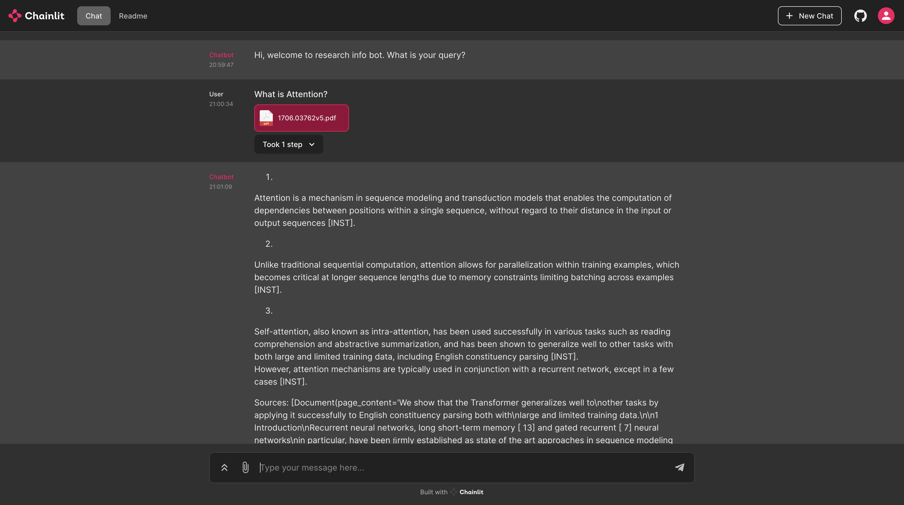

# RAG with Ollama

## Usage



## Installation

Please install Ollama form here: https://ollama.ai. If you are on windows please use WSL2. See https://github.com/jmorganca/ollama.


Then you need to download the model that you want to use. The easiest way is to open your terminal and run the following command:

```bash
ollama run zephyr
```

Then you can install the project with the following command:

```bash
git clone https://github.com/mfmezger/ollama-rag.git
cd ollama-rag

poetry install # if you have not yet installed poetry run: pip install poetry

# you need to start the vector database using docker
docker compose up qdrant -d

poetry run chainlit run -w  ollama_rag/app.py
```

(If you do not want to use poetry install with pip install -r requirements.txt)

You can upload your own pdfs in the web interface. They will then be loaded in the Qdrant Vectordatabase.

The webinterface is available at: http://localhost:8000
The REST API is available at: http://localhost:8000/docs

If you want to upload a bulk of pdf documents i would recomment using the embeddings/document endpoint.


### Docker setup (backend & Frontend & Vectordatabase)

If using docker you need to change the url in the main configuration file.
Navigate to the config in config/main.yml. Then change in the embeddings and ollama at the bottom of the file the url type displayed there.

```bash
docker compose up -d
```

### Full docker setup (everything including ollama in docker)

If you want a full docker system meaning also running ollama in the container you need to add the following to the docker-compose.yml file:

```yaml
  ollama:
    image: ollama/ollama
    container_name: ollama
    ports:
      - "11434:11434"
    volumes:
      - "ollama:/root/.ollama"
    restart: unless-stopped

volumes:
  ollama:
    driver: local
```

But be careful with out harware acceleration like Apple Silicons Metal or GPUs the performance will be not be optimal.

## Changing the model

If you want to change the midek you need to change it in config/main.yml. The embedding model can be changed seperatly from the chat model. Afterwards do not forget to download the models initially with running the ollama run model_name command in your terminal.

All available models can be found here: https://ollama.ai/library.
